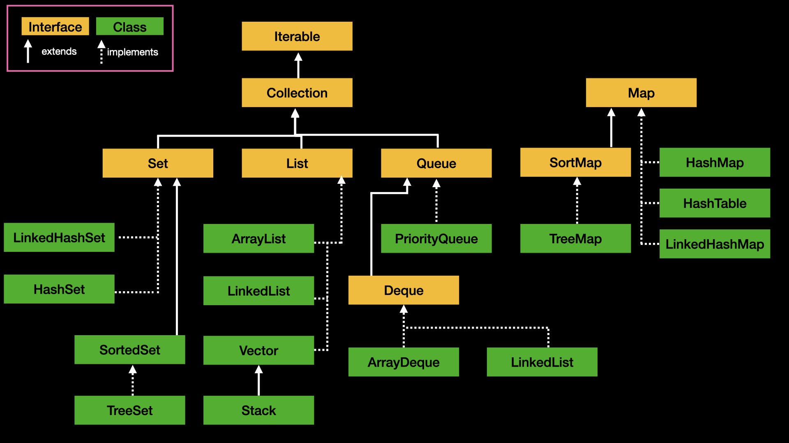

# 🗂️ 컬렉션 및 자료구조 마스터 가이드

> 크기가 동적으로 변하는 자바의 핵심 자료구조(Collection)들과 이를 제어하는 유틸리티 도구입니다.

---

## 🛠️ java.util.Collections (자료구조 제어 유틸리티)
`List`, `Set` 같은 컬렉션 객체들을 다루는 static 메서드 모음입니다.

| 메서드 | 설명 | 예시 |
| :--- | :--- | :--- |
| `Collections.sort(리스트)` | 리스트를 오름차순 정렬 | `Collections.sort(list);` |
| `Collections.sort(리스트, 기준)` | 내림차순 등 지정한 커스텀 기준으로 리스트를 정렬 | `Collections.sort(list, Collections.reverseOrder());` |
| `Collections.reverse(리스트)` | 현재 리스트 요소의 앞뒤 순서를 그대로 뒤집음 | `Collections.reverse(list);` |
| `Collections.max(리스트)` / `min` | 리스트 내에서 가장 큰 값 / 가장 작은 값을 찾아서 반환 | `int max = Collections.max(list);` |
| `Collections.frequency(리스트, 값)` | 리스트 내에 지정한 값이 몇 개 포함되어 있는지 개수를 셈 | `int count = Collections.frequency(list, 5);` |

---

## 📦 핵심 자료구조 클래스


### 1. ArrayList (동적 배열)
크기가 고정된 일반 배열과 달리, 데이터가 늘어남에 따라 크기가 자동으로 늘어나는 리스트입니다.
- **선언법:** `List<Integer> list = new ArrayList<>();`
- **주요 메서드:** `.add(값)`, `.get(인덱스)`, `.set(인덱스, 새값)`, `.remove(인덱스)`, `.size()`, `.contains(값)`

### 2. HashMap (해시 맵)
Key-Value 쌍으로 데이터를 관리하며, 특정 키를 기반으로 값을 $O(1)$만에 찾을 때 사용합니다. 중복 제거 및 데이터 빈도수 카운팅에 특화되어 있습니다.
- **선언법:** `Map<String, Integer> map = new HashMap<>();`
- **주요 메서드:** `.put(키, 값)`, `.get(키)`, `.containsKey(키)`, `.keySet()`
- **실전 팁 (빈도수 카운팅):**
  ```java
  map.put(key, map.getOrDefault(key, 0) + 1);


### 3. PriorityQueue (우선순위 큐 / Heap)
저장된 순서와 관계없이, 정렬 기준에 따라 가장 우선순위가 높은 데이터가 먼저 추출되는 자료구조입니다.
- **선언법 (최소 힙):** PriorityQueue<Integer> pq = new PriorityQueue<>();
- **선언법 (최대 힙):** PriorityQueue<Integer> pq = new PriorityQueue<>(Collections.reverseOrder());
- **주요 메서드:** .add(값), .poll() (우선순위 높은 값 꺼내고 제거), .peek() (확인만 하기), .isEmpty()

### 4. Queue,Stack
보통 ArrayDeque 구현체를 사용해서 구현한다.

- **주요 메서드:** offer(),poll(),peek() 예외를 직접 던지지 않고 null,false를 반환한다.
